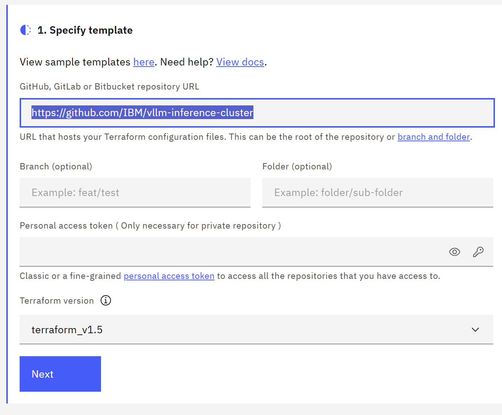
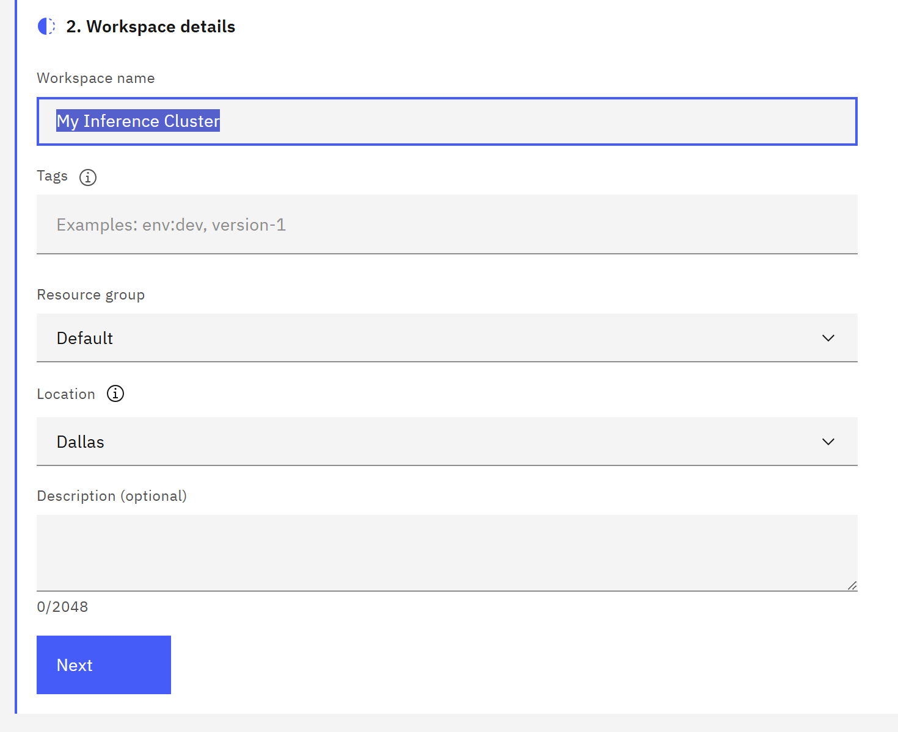
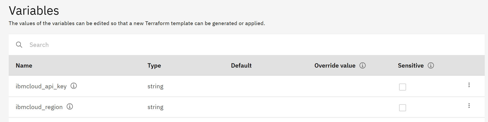
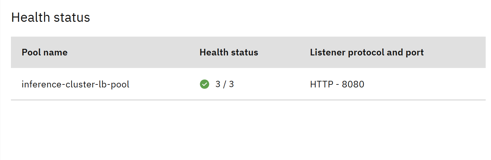

# vLLM Inference Cluster for IBM Cloud VPC

The vLLM Inference Cluster is a Terraform Infrastructure as Code deployment of a highly available
and scalable inferencing cluster based on vLLM for IBM Cloud VPC. It supports direct consumption of
models from a Hugging Face repository or can be used with a model stored in an IBM Cloud Object
Storage bucket.

## Quick Start

The easiest way to deploy the cluster on IBM Cloud is to use
[IBM Cloud Schematics](https://cloud.ibm.com/schematics/workspaces/create). Create a Schematics
Workspace by supplying a name for your new workspace and the URL of this GitHub repository. When the
workspace loads you will only need two variables to deploy the cluster. See
[Working with Schematics](#working-with-schematics) for details on IBM Cloud Schematics.

| Variable | Description|
|---|---|
| `ibmcloud_api_key` | An API key for your account with access to create VPC infrastructure. To create an API Key visit [API keys](https://cloud.ibm.com/iam/apikeys) in the IBM Cloud portal and click "Create". |
| `ibmcloud_region` | The IBM Cloud region you'd like to deploy your cluster. Hint: Unsure? Try `br-sao`. Visit the IBM Cloud documentation for [Creating a VPC in a different region](https://cloud.ibm.com/docs/vpc?topic=vpc-creating-a-vpc-in-a-different-region) to discover more VPC regions where you can deploy your cluster. |

By default this will create a cluster with 3 virtual machines with L40s GPUs. These are costly, so
be sure you are aware of the costs before spinning up your cluster. You can use the
[IBM Cloud cost estimator](https://www.ibm.com/cloud/cloud-calculator) to help plan your
deployment. Want to try the cluster with less or more nodes? Use the `inference_worker_count`
variable to specify the number (1 or more) of nodes you'd like in your cluster. See
[Inputs](#inputs) to explore all the variables offered for this cluster.

## Deploying

Deploying the cluster can be done using the
[command line tool for Terraform](https://developer.hashicorp.com/terraform/cli/commands)
or using [IBM Cloud Schematics](https://www.ibm.com/products/schematics). Using the command line
is recommended when needing to debug the cluster. Otherwise, it is recommended to use Schematics.

### Working with Schematics

To see a comprehensive guide on using IBM Cloud Schematics, visit
[Getting started with IBM Cloud Schematics](https://cloud.ibm.com/docs/schematics?topic=schematics-getting-started).
This section will cover some basics of using IBM Cloud Schematics to help with deploying this
automation.

Get started by going to
[IBM Cloud Schematics](https://cloud.ibm.com/automation/schematics/terraform).
IBM Cloud Schematics offers "Workspaces" as a working area for each instantiation of an automation
(like this repository). This page will show all the workspaces you've created. To create a new
workspace to instantiate (and deploy) this automation, click "Create".

| Specify Template | Workspace Details |
|---|---|
|||

Specify this repository's URL for the repository URL and ensure the Terraform version is set to 1.5
or greater. Click Next, then give the workspace a name and any other details you'd like. You may
choose to use any Resource Group or Location. Note, This location is the location of where the
workspace will be created and not the [resources](#resources) created by this automation. That is
controlled by the `ibmcloud_region` variable.

Once your Workspace is created. Use the Variables section below the Details on the Settings page to
configure. The only variables that are required are the `ibmcloud_api_key` variable to allow Schematics access to create the resources and the
`ibmcloud_region` variable to set the location where the [resources](#resources) are created.

An application programming interface key (API key) is a unique code that is passed in to an API to
identify the calling application or user. The API key often acts as both a unique identifier and a
secret token for authentication, and is assigned a set of access that is specific to the identity
that is associated with it. To learn more about API Keys visit the
[Understanding API Keys](https://cloud.ibm.com/docs/account?topic=account-manapikey&interface=ui)
IBM Cloud documentation.

To create an API Key for your user visit [API keys](https://cloud.ibm.com/iam/apikeys) in the IBM
Cloud portal and click "Create". Alternatively, you can create a Service ID with limited access for
this. Visit the IBM Cloud documentation
[Managing service ID API keys](https://cloud.ibm.com/docs/account?topic=account-serviceidapikeys&interface=ui)
to learn about creating Service IDs and managing their access. Whichever API key you supply for the
variable `ibmcloud_api_key` it will need the proper access to create the [resources](#resources)
created by this automation.

The second required variable is the `ibmcloud_region`. The value for this will be the region in
IBM Cloud VPC the infrastructure [resources](#resources) are created. Visit the IBM Cloud
documentation for
[Creating a VPC in a different region](https://cloud.ibm.com/docs/vpc?topic=vpc-creating-a-vpc-in-a-different-region)
to discover all of the VPC regions where you can deploy your cluster.

Optional [variables](#inputs) can be specified as well. Supplying these values can allow you to use
alternate virtual server profiles, set the number of instances in your cluster, use a model from
Cloud Object Storage, or specify advanced parameters for vLLM. Read all the variable descriptions
and their defaults to understand what each does.

After setting the variables, you may use the "Apply plan" button at the top of the page to deploy.

### Wait for Deployment

Once the automation is applied, you will need to wait for the servers to boot and the install
scripts to complete. This can take 5-10 minutes. One way to ensure that the install is complete is
to look in the Cloud Portal at the
[VPC Load Balancer](https://cloud.ibm.com/infrastructure/network/loadBalancers) that hosts the
endpoint for your application. The load balancer performs a health check against the inference nodes
in your cluster and will report a health status for the cluster. Once you have a green status
showing all the nodes in your cluster as healthy, your cluster is ready for use.

### Output

This automation only has one output, the `openai_endpoint_base_url`. This is the endpoint on the
load balancer your application will connect with. You can find this at the end of the log for the
Schematics apply job, or using the command `terraform outputs` if you deployed using the CLI. You
can also view the load balancer created in the
[Load balancers for VPC](https://cloud.ibm.com/infrastructure/network/loadBalancers) cloud portal.
The endpoint is the hostname of the load balancer with the listener port and the OpenAI API path
`/v1`. The format is `http://<hostname>:<listener_port>/v1`.

## vLLM

vLLM is a fast and easy-to-use library for LLM inference and serving a given model. It provides an
[OpenAI compatible API](https://docs.vllm.ai/en/latest/serving/openai_compatible_server.html?ref=blog.mozilla.ai)
to make integrating with your application easy. Each node in this cluster runs vLLM and the endpoint
for your application is hosted by the load balancer they are all members of.

[vLLM](https://docs.vllm.ai/en/latest/index.html) is fast with:

- State-of-the-art serving throughput
- Efficient management of attention key and value memory with PagedAttention
- Continuous batching of incoming requests
- Fast model execution with CUDA/HIP graph
- Quantizations: GPTQ, AWQ, INT4, INT8, and FP8.
- Optimized CUDA kernels, including integration with FlashAttention and FlashInfer.
- Speculative decoding
- Chunked prefill

See [Welcome to vLLM](https://docs.vllm.ai/en/latest/) for more information.

## Extras

This repository contains extra code samples to help you test and take advantage of your cluster.

### LibreChat

LibreChat is the ultimate open-source app for all your AI conversations, fully customizable and
compatible with any AI provider — all in one sleek interface.

See the [LibreChat IaC Readme](./extra/librechat/README.md)
for more information on how to configure and use it with your cluster.

## Architecture

The VPC and networking resources are created using the
[IBM Secure Landing Zone](https://github.com/terraform-ibm-modules/terraform-ibm-landing-zone-vpc)
using mostly default options. This gives us the a great place to start for deploying the vLLM
cluster. This automation does not use
[VPC cluster networking](https://cloud.ibm.com/docs/containers?topic=containers-plan_vpc_basics).

This cluster provides a multi-zonal deployment of an instance group. The instances that are created
by the instance group each have an attached data volume that is populated with the model and the
vLLM runtime when they are provisioned. Models are either downloaded from HuggingFace or a COS
bucket.

For the models to be accessible by client applications, an Open AI compatible API is offered by vLLM
and served up through an application load balancer.

The automation provided by this repository will create and configure the resources in the green
outlined box in the diagram below. The other components, "Application VPC" and Transit Gateway,
denote a typical integration with this cluster. The Application VPC would contain some application,
like a web server, that would use the inference cluster to run AI queries over the Open AI API. IBM
Cloud Transit Gateway interconnects your IBM Cloud VPCs with compute resources across the globe.
Read more about Transit Gateway in the IBM Cloud documentation
[About IBM Cloud Transit Gateway](https://cloud.ibm.com/docs/transit-gateway?topic=transit-gateway-about).

<!-- BEGINNING OF PRE-COMMIT-TERRAFORM DOCS HOOK -->
## Requirements

| Name | Version |
|------|---------|
|  [terraform](#requirement\_terraform) | >=1.5 |
|  [http](#requirement\_http) | 3.4.1 |
|  [ibm](#requirement\_ibm) | 1.60.1 |

## Modules

| Name | Source | Version |
|------|--------|---------|
|  [vpc](#module\_vpc) | terraform-ibm-modules/landing-zone-vpc/ibm | 7.17.1 |

## Resources

| Name | Type |
|------|------|
| [ibm_iam_trusted_profile.inference](https://registry.terraform.io/providers/IBM-Cloud/ibm/1.60.1/docs/resources/iam_trusted_profile) | resource |
| [ibm_iam_trusted_profile_claim_rule.inference](https://registry.terraform.io/providers/IBM-Cloud/ibm/1.60.1/docs/resources/iam_trusted_profile_claim_rule) | resource |
| [ibm_iam_trusted_profile_policy.cos](https://registry.terraform.io/providers/IBM-Cloud/ibm/1.60.1/docs/resources/iam_trusted_profile_policy) | resource |
| [ibm_is_instance_group.inference](https://registry.terraform.io/providers/IBM-Cloud/ibm/1.60.1/docs/resources/is_instance_group) | resource |
| [ibm_is_instance_template.inference](https://registry.terraform.io/providers/IBM-Cloud/ibm/1.60.1/docs/resources/is_instance_template) | resource |
| [ibm_is_lb.inference](https://registry.terraform.io/providers/IBM-Cloud/ibm/1.60.1/docs/resources/is_lb) | resource |
| [ibm_is_lb_listener.inference](https://registry.terraform.io/providers/IBM-Cloud/ibm/1.60.1/docs/resources/is_lb_listener) | resource |
| [ibm_is_lb_pool.inference](https://registry.terraform.io/providers/IBM-Cloud/ibm/1.60.1/docs/resources/is_lb_pool) | resource |
| [ibm_is_security_group.load_balancer](https://registry.terraform.io/providers/IBM-Cloud/ibm/1.60.1/docs/resources/is_security_group) | resource |
| [ibm_is_security_group.nodes](https://registry.terraform.io/providers/IBM-Cloud/ibm/1.60.1/docs/resources/is_security_group) | resource |
| [ibm_is_security_group_rule.in_lb](https://registry.terraform.io/providers/IBM-Cloud/ibm/1.60.1/docs/resources/is_security_group_rule) | resource |
| [ibm_is_security_group_rule.in_ssh](https://registry.terraform.io/providers/IBM-Cloud/ibm/1.60.1/docs/resources/is_security_group_rule) | resource |
| [ibm_is_security_group_rule.in_uvicorn](https://registry.terraform.io/providers/IBM-Cloud/ibm/1.60.1/docs/resources/is_security_group_rule) | resource |
| [ibm_is_security_group_rule.out_lb](https://registry.terraform.io/providers/IBM-Cloud/ibm/1.60.1/docs/resources/is_security_group_rule) | resource |
| [ibm_is_security_group_rule.out_nodes](https://registry.terraform.io/providers/IBM-Cloud/ibm/1.60.1/docs/resources/is_security_group_rule) | resource |
| [http_http.pubip](https://registry.terraform.io/providers/hashicorp/http/3.4.1/docs/data-sources/http) | data source |
| [ibm_is_image.inference](https://registry.terraform.io/providers/IBM-Cloud/ibm/1.60.1/docs/data-sources/is_image) | data source |
| [ibm_is_ssh_key.inference](https://registry.terraform.io/providers/IBM-Cloud/ibm/1.60.1/docs/data-sources/is_ssh_key) | data source |
| [ibm_resource_group.group](https://registry.terraform.io/providers/IBM-Cloud/ibm/1.60.1/docs/data-sources/resource_group) | data source |

## Inputs

| Name | Description | Type | Default | Required |
|------|-------------|------|---------|:--------:|
|  [data\_volume\_capacity](#input\_data\_volume\_capacity) | Each inference node instance has a data volume attached to it. It will contain the files     required for vLLM and the model downloaded from COS. The default size for this is 100GiB. This     should be sufficient for most models, although for very large models you may need to increase     the size of this volume. | `number` | `100` | no |
|  [data\_volume\_profile](#input\_data\_volume\_profile) | Each inference node instance has a data volume attached to it. It will contain the files     required for vLLM and the model downloaded from COS. The size for this volume is determined by     the variable `data_volume_capacity`. This variable is to set the profile of that volume. The     profile will determine the performance (in IOPS) for it. The default profile `general-purpose`     is a standard tier of performance. Because the model will be loaded into the GPU memory when     used for inference, the speed of this volume will only affect the load time into the GPU     during vLLM startup. | `string` | `"general-purpose"` | no |
|  [ibmcloud\_api\_key](#input\_ibmcloud\_api\_key) | An IBM Cloud API key that will be used to authenticate the creation of resources needed for the     inference cluster.      An application programming interface key (API key) is a unique code that is passed in to an API     to identify the calling application or user. API keys are used to track and control how the API     is being used, for example to prevent malicious use or abuse of the API. The API key often acts     as both a unique identifier and a secret token for authentication, and is assigned a set of     access that is specific to the identity that is associated with it.      To learn how to create and manage API keys, please visit the IBM Cloud documentation for     [Managing user API Keys](https://cloud.ibm.com/docs/account?topic=account-userapikey&interface=ui). | `string` | n/a | yes |
|  [ibmcloud\_region](#input\_ibmcloud\_region) | The IBM Cloud VPC region where the inference cluster resources will be created.      A region is a specific geographical location where you can deploy apps, services, and other     IBM Cloud resources. Regions consist of one or more zones, which are physical data centers     that house the compute, network, and storage resources, with related cooling and power, for     host services and applications.      To learn more about IBM Cloud regions, please visit the IBM Cloud documentation for     [Creating a VPC in a different region](https://cloud.ibm.com/docs/vpc?topic=vpc-creating-a-vpc-in-a-different-region). | `string` | n/a | yes |
|  [inference\_node\_base\_image\_name](#input\_inference\_node\_base\_image\_name) | Each inference node is comprised of vLLM running on a virtual server instance. The base image     name is the name of the IBM Cloud VPC stock image used as the underlying Operating System for     vLLM to run on. The scripts included with this automation are tested with only the default     value of this variable.      It is possible to use another Ubuntu or Debian version provided by IBM Cloud VPC by setting     this variable to another VPC stock image name. However, it is not supported or tested. | `string` | `"ibm-ubuntu-24-04-6-minimal-amd64-1"` | no |
|  [inference\_node\_count](#input\_inference\_node\_count) | An instance group is used to create N number of instances used for inference nodes. The     instances created by the group will attempt to be spread equally across all the subnets     defined by the variable `subnets`.      This variable is used to request how many instances will be created and maintained by the     instance group. If a node fails its health check or is otherwise removed, the instance group     will create another instance to maintain the number requested. | `number` | `3` | no |
|  [inference\_node\_instance\_profile](#input\_inference\_node\_instance\_profile) | The instance profile used to create the instance for each inference node. An instance profile     is a combination of instance attributes, such as the number of vCPUs, amount of RAM, network     bandwidth, and GPU type and quantity. The attributes define the size and capabilities of the     virtual server instance that is provisioned.      A vLLM inference node must be run by a virtual server with at least one GPU. By default an     instance profile with a single L40s GPU is used. However, any VPC profile with a Nvidia GPU     will work.      Important, review pricing of these profiles before provisioning this automation. You can find     all the GPU profiles listed in the IBM Cloud documentation for     [x86-64 instance profiles](https://cloud.ibm.com/docs/vpc?topic=vpc-profiles&interface=ui#gpu).     Use the [IBM Cloud cost estimator](https://www.ibm.com/cloud/cloud-calculator) to help plan     your deployment. | `string` | `"gx3-24x120x1l40s"` | no |
|  [inference\_node\_ssh\_key\_name](#input\_inference\_node\_ssh\_key\_name) | Attaching an SSH key to an inference node instance can allow you to debug issues manually. By     default no key is added to the authorized key file of the instance. Use this only for debug.     When a key is added, an ingress security group rule is also created for the SSH port (22) from     the IP address of the machine where the automation was applied from. This should only be used     when deploying this IaC from your local machine (i.e., not IBM Cloud Schematics or Projects). | `string` | `""` | no |
|  [load\_balancer\_port](#input\_load\_balancer\_port) | The inference nodes created are all members of a load balancer to distribute requests across     them equally. The output of this automation `openai_endpoint_base_url` will serve an OpenAI     compatible API for your application to communicate with. This variable is used to set the     port number of that endpoint by the load balancer for your application to connect to.      By default this is set to port `8080`. | `string` | `"8080"` | no |
|  [load\_balancer\_type](#input\_load\_balancer\_type) | The inference nodes created are all members of a load balancer to distribute requests across     them equally. The load balancer is private by default. This means that only other network     interfaces that are part of the VPC will be able to access it. You can also create a bridge     from another VPC or network boundary by using an IBM Transit Gateway.      To expose the inference cluster to the public internet you can specify this variable as     `public`. However, this is not recommended. The intended use case for this cluster is to be     used by another application in IBM Cloud or through a private connection such as a VPN. | `string` | `"private"` | no |
|  [model\_cos\_bucket\_name](#input\_model\_cos\_bucket\_name) | To serve a custom model stored in an IBM Cloud Object Storage bucket, specify the name of the     bucket where the model is in. Only one model and its associated files should be in the bucket.     You may not have more than one model in the bucket and serve it simultaneously, or switch to     it, from the cluster.      When a COS bucket is used to host the model, a trusted profile rule is created to allow the     Reader role access to COS from the VPC the inference node instances are in. This allows access     to the bucket without passing the API key to each of the instances.      Specifying a COS bucket for the model to serve will supersede any model specified by the     variable `model_huggingface_name`. | `string` | `""` | no |
|  [model\_huggingface\_name](#input\_model\_huggingface\_name) | To use a model hosted by Hugging Face on HuggingFace.co, specify the repository slug that     contains the model. This is generally in the format of `<organization>/<model-name>`. You     should be able to use most text generation models.      By default the IBM Granite version 3.1 (2B parameter) model is used. | `string` | `"ibm-granite/granite-3.1-2b-instruct"` | no |
|  [prefix](#input\_prefix) | The prefix, or in some cases the name, for every resource created by this automation. | `string` | `"inference-cluster"` | no |
|  [resource\_group\_name](#input\_resource\_group\_name) | The name of the Resource Group every resource created by this automation will be added to. The     API key given for the variable `ibmcloud_api_key` will need to have the Editor or Administrator     platform access role to create resources.      By default resources are created in the `Default` Resource Group for the account. | `string` | `"Default"` | no |
|  [subnets](#input\_subnets) | Subnets are created in the VPC to place the inference nodes in. The inference nodes are virtual     server instances each running vLLM serving the model of your choice either from Hugging Face     or one of your IBM Cloud Object Storage bucket.      By default 3 subnets are created, one for each zone in the region. This allows a virtual server     instance group with 3 inference nodes to span a region equally with 1 node (instance) in each     zone.      The schema provided to define subnets allows you to create 0-N subnets in each zone (1-3). Each     zone is a list of subnet objects. The subnet object must contain a name for the subnet and a     non-overlapping CIDR in the VPC. | <pre>object({     zone-1 = list(object(       {         name = string,         cidr = string       }     )),     zone-2 = list(object(       {         name = string,         cidr = string       }     )),     zone-3 = list(object(       {         name = string,         cidr = string       }     ))   })</pre> | <pre>{   "zone-1": [     {       "cidr": "10.10.10.0/24",       "name": "subnet-inference-1"     }   ],   "zone-2": [     {       "cidr": "10.20.10.0/24",       "name": "subnet-inference-2"     }   ],   "zone-3": [     {       "cidr": "10.30.10.0/24",       "name": "subnet-inference-3"     }   ] }</pre> | no |
|  [vllm\_serve\_options](#input\_vllm\_serve\_options) | The application vLLM is used to run inference jobs against a model and serve an OpenAI     compatible API from the virtual server. These options are used to adjust parameters for vLLM.     You may specify any option for the `vllm serve` command.      See all the available options in the     [vLLM documentation](https://docs.vllm.ai/en/latest/serving/openai_compatible_server.html#cli-reference) | `map(string)` | <pre>{   "max-model-len": 8192,   "served-model-name": "cluster-model" }</pre> | no |

## Outputs

| Name | Description |
|------|-------------|
|  [openai\_endpoint\_base\_url](#output\_openai\_endpoint\_base\_url) | This is the public endpoint of the application load balancer |
<!-- END OF PRE-COMMIT-TERRAFORM DOCS HOOK -->
